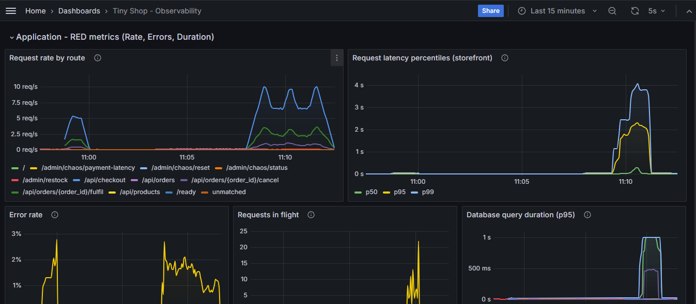
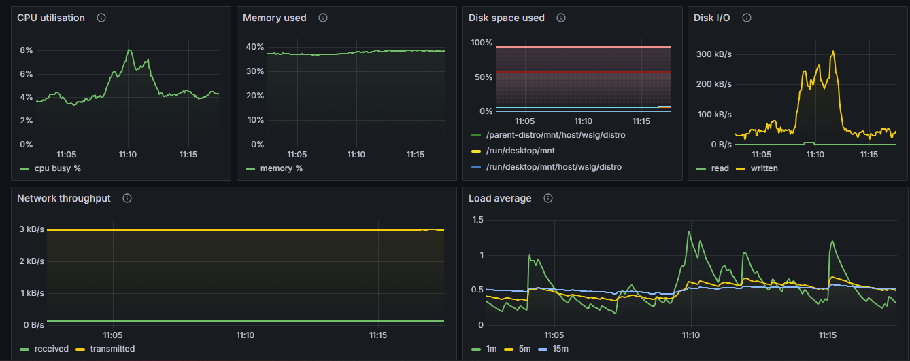
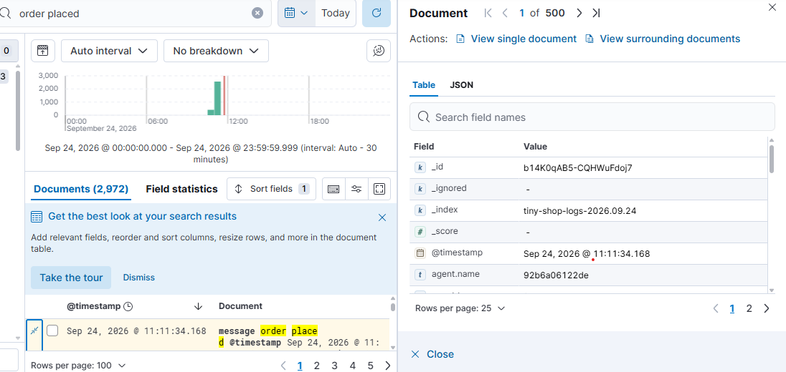
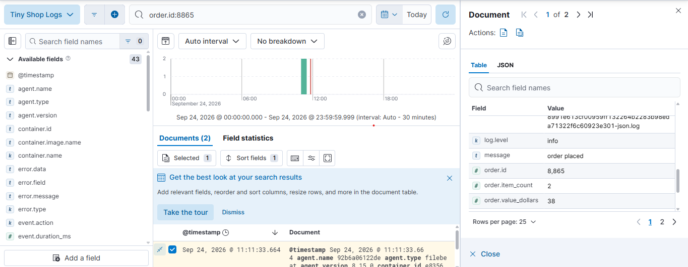
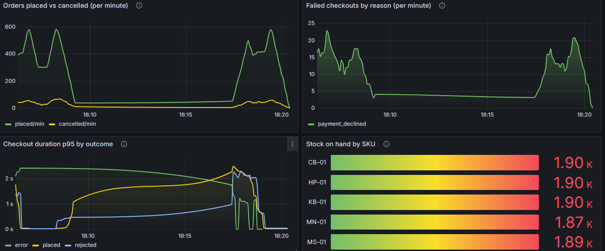

# Assignment 1: Observability — Report

**Enterprise Software Development, Fall 2026**

| | |
| :-- | :-- |
| **Name** | Muskan Rehan |
| **Student ID** | mr09207 |
| **Project** | Tiny Shop — a small e-commerce application |

Setup, running and teardown instructions: **[`README.md`](README.md)**.
Architecture diagram and the metric/log walkthroughs: **[`docs/architecture.md`](docs/architecture.md)**.

---

# Part A — The project

## The problem

A small independent retailer sells a handful of products online. The shop works
until it does not, and when it stops working the owner finds out from customers
rather than from the system. The specific failure they cannot see is the worst
one which is checkout silently degrading. The site is up, the catalogue loads, but
orders are slow or quietly failing, usually because the payment provider is
having a bad day.

Two questions cannot be answered today:

1. *Is the shop slow right now, and where is the time going?*
2. *That customer says order #1041 never went through — what actually happened?*

These are different questions and they need different tools. The first is a
question about aggregates over time, which is what metrics are for. The second
is a question about one specific event, which is what logs are for. Building
only one of the two leaves half the problem unsolved.

## Intended users

| User | What they need |
| :-- | :-- |
| **Shop owner** | Orders placed, orders cancelled, revenue, what is waiting to ship, and whether failures are costing money right now. |
| **On-call developer** | Response times and percentiles, error rates, which dependency is slow, host CPU and memory — and the ability to find one request by id. |
| **Customer** | A storefront that works, and honest failure when it cannot. |

## The solution

**Tiny Shop**: a two-service e-commerce application backed by Postgres, wrapped
in a complete observability stack.

- **`storefront-api`** (FastAPI, port 8000) — serves the storefront page and the
  API: browse the catalogue, place an order, cancel it, mark it fulfilled. It
  owns the order lifecycle and all the business metrics.
- **`payment-service`** (FastAPI, port 8001) — a mock card processor. It
  approves, declines, or fails, and it holds the fault-injection switches used
  in Part E. It is a separate service on purpose: a real shop's payment provider
  is something you depend on and do not control, and Part E needs a dependency
  that can genuinely break.
- **Postgres** — products, orders and order items.

The checkout is a real transaction, not a stub. It takes `FOR UPDATE` row locks
on the products (always in SKU order) so two concurrent checkouts cannot both
sell the last unit, decrements stock, writes the order, and only then charges
payment. **If the charge fails, the whole transaction rolls back** — so a
payment failure never silently consumes inventory. The price of that design is
that the locks are held for the whole payment call; Part E.1 shows exactly what
that costs when the provider slows down.

## What works

| Capability | How to see it |
| :-- | :-- |
| Browse a catalogue of 5 products with live stock | <http://localhost:8000> |
| Add to cart, place an order, see it appear | the same page |
| Cancel an order — stock returns to the shelf | "Cancel" button on a PLACED order |
| Fulfil an order — the open-orders gauge drops | "Fulfil" button |
| Orders survive a restart | `docker compose restart storefront-api`, reload |
| Out-of-stock, declined cards and provider outages all fail cleanly | `shopctl fault ...`, then try to check out |
| Full API, documented | <http://localhost:8000/docs> |

---

# Part B — Metrics

Prometheus scrapes four targets every **5 seconds** — `storefront-api`,
`payment-service`, `node-exporter`, and itself; Grafana renders one provisioned
dashboard (`tiny-shop`) with **27 panels** in five rows. There are **23
instrument declarations** across the two services, covering **20 distinct metric
names**, and **all four Prometheus metric types** are used:

| Type | Count | Metric names |
| :-- | --: | :-- |
| **Counter** | 9 | `http_requests_total`, `payment_calls_total`, `payment_charges_total`, `shop_orders_placed_total`, `shop_orders_cancelled_total`, `shop_orders_rejected_total`, `shop_revenue_dollars_total`, `demo_requests_total`, `demo_requests_safe_total` |
| **Gauge** | 3 | `http_requests_in_flight`, `shop_orders_awaiting_fulfilment`, `shop_stock_units` |
| **Histogram** | 6 | `http_request_duration_seconds`, `db_query_duration_seconds`, `payment_call_duration_seconds_hist`, `payment_charge_amount_dollars`, `shop_order_value_dollars`, `shop_checkout_duration_seconds` |
| **Summary** | 2 | `payment_call_duration_seconds`, `shop_items_per_order` |


## B.1 The metric table

Unless noted, "where recorded" is a path under `services/`.

### Application metrics — storefront-api

| # | Metric | Type | Unit | Labels | Where and how it is recorded |
| :-- | :-- | :-- | :-- | :-- | :-- |
| 1 | `http_requests_total` | **Counter** | requests | `method`, `route`, `status` | `storefront-api/app/application.py` — the `observe` middleware, in its `finally` block, so it counts even when the handler raises. `.inc()` once per request. |
| 2 | `http_request_duration_seconds` | **Histogram** | seconds | `method`, `route` | Same middleware. `perf_counter()` around `call_next`, then `.observe(duration)`. Buckets: 5 ms → 5 s, with extra edges at 0.5/0.75 s so the Part E fault is resolvable. |
| 3 | `http_requests_in_flight` | **Gauge** | requests | — | Same middleware: `.inc()` on arrival, `.dec()` in `finally`. |
| 4 | `payment_call_duration_seconds` | **Summary** | seconds | `outcome` | `storefront-api/app/clients.py`, `charge()` — `.observe(elapsed)` in `finally`. Exposes `_sum` and `_count` only (see B.3). |
| 5 | `payment_call_duration_seconds_hist` | **Histogram** | seconds | `outcome` | Same place, same measurement — bucketed so p95/p99 are computable (see B.3). |
| 6 | `payment_calls_total` | **Counter** | calls | `outcome` | Same place. `outcome` ∈ approved / declined / error / timeout. |
| 7 | `db_query_duration_seconds` | **Histogram** | seconds | `operation` | `storefront-api/app/db.py`, the `cursor()` context manager — every database call is timed, labelled by logical operation, not by SQL text. |

### Application metrics — payment-service

| # | Metric | Type | Unit | Labels | Where and how it is recorded |
| :-- | :-- | :-- | :-- | :-- | :-- |
| 8 | `http_requests_total` | **Counter** | requests | `method`, `route`, `status` | `payment-service/app/application.py` — same middleware pattern. |
| 9 | `http_request_duration_seconds` | **Histogram** | seconds | `method`, `route` | Same middleware. |
| 10 | `http_requests_in_flight` | **Gauge** | requests | — | Same middleware. |

### Business metrics — the shop

| # | Metric | Type | Unit | Labels | Where and how it is recorded |
| :-- | :-- | :-- | :-- | :-- | :-- |
| 11 | `shop_orders_placed_total` | **Counter** | orders | `payment_method` | `storefront-api/app/routes.py`, `checkout()` — `.inc()` after the charge is approved *and* the transaction has committed. Never counts an order that rolled back. |
| 12 | `shop_orders_cancelled_total` | **Counter** | orders | `reason` | `routes.py`, `cancel_order()` — after the cancel commits. |
| 13 | `shop_orders_rejected_total` | **Counter** | checkouts | `reason` | `routes.py`, `checkout()` — on every failure path. `reason` ∈ out_of_stock / unknown_sku / payment_declined / payment_error / payment_timeout. |
| 14 | `shop_orders_awaiting_fulfilment` | **Gauge** | orders | — | `routes.py`: `.inc()` on placement, `.dec()` on cancel and on fulfil. Also **re-read from Postgres at startup** (`refresh_open_orders_gauge`) so a restart cannot make it lie. |
| 15 | `shop_stock_units` | **Gauge** | units | `sku` | `routes.py`, `refresh_stock_gauge()` — `.set()` from a `SELECT`, called after every stock change. Set from the source of truth, not incremented blindly. |
| 16 | `shop_revenue_dollars_total` | **Counter** | dollars | — | `routes.py`, `checkout()` — `.inc(value_dollars)`. A counter can increase by any non-negative amount, not only 1. |
| 17 | `shop_order_value_dollars` | **Histogram** | dollars | — | `routes.py`, `checkout()` — `.observe(value_dollars)`. **This is the metric explored beyond the class examples** (see B.4). |
| 18 | `shop_items_per_order` | **Summary** | items | — | `routes.py`, `checkout()` — `.observe(item_count)`. Average basket size. |
| 19 | `shop_checkout_duration_seconds` | **Histogram** | seconds | `outcome` | `routes.py`, `checkout()` — in a `finally` around the whole function, so every exit path (placed, rejected, error) is timed. |
| 20 | `payment_charges_total` | **Counter** | charges | `outcome` | `payment-service/app/routes.py`, `charge()` — the provider's own view of approvals vs declines. |
| 21 | `payment_charge_amount_dollars` | **Histogram** | dollars | — | Same place, approved charges only. |

### Experiment-only metrics (Part E.2)

| # | Metric | Type | Unit | Labels | Where and how it is recorded |
| :-- | :-- | :-- | :-- | :-- | :-- |
| 22 | `demo_requests_total` | **Counter** | requests | `request_id` unbounded  or none, when started with `CARDINALITY_DEMO_LABEL=none` | `storefront-api/app/application.py` middleware, **only while the toggle is on**, capped at 100 distinct ids. Built by `telemetry.py`, `make_demo_counter()`. Exists to be measured and removed. |
| 23 | `demo_requests_safe_total` | **Counter** | requests | `tier` (2 values) | `routes.py`, `safe_counter()` — the bounded replacement. |

**Label discipline.** Every label above except #22 has a small fixed set of
values: route *templates* (not raw URLs), HTTP status, five SKUs, and closed
enums for `reason` and `outcome`. Unmatched URLs collapse into a single
`route="unmatched"` bucket so a scanner hitting random paths cannot create
series. Order ids, customer names and request ids appear **only in logs**.

## B.2 Dashboard panels — queries and what they show

Open at **<http://localhost:3000/d/tiny-shop>**.



### Row 1 — Application (RED)

| Panel | Query | What it shows |
| :-- | :-- | :-- |
| Request rate by route | `sum by (route) (rate(http_requests_total{job="storefront-api"}[1m]))` | Traffic per second, split by route template. One line per endpoint, so you can see whether a spike is browsing or checkouts. |
| Request latency percentiles | `histogram_quantile(0.95, sum by (le) (rate(http_request_duration_seconds_bucket{job="storefront-api"}[1m])))` (also 0.50, 0.99) | p50/p95/p99 over a trailing 1-minute window. The gap between p50 and p99 is the tail — during the Part E fault p50 barely moves while p99 jumps. |
| Error rate | `100 * sum(rate(http_requests_total{job="storefront-api",status=~"5.."}[1m])) / clamp_min(sum(rate(http_requests_total{job="storefront-api"}[1m])), 0.001)` | Percentage of requests failing. 4xx and 5xx are plotted separately: 4xx means the customer's request was rejected (declined card, out of stock), 5xx means we broke. `clamp_min` prevents a divide-by-zero spike when there is no traffic. |
| Requests in flight | `http_requests_in_flight` | Concurrency right now. A gauge that climbs while latency climbs is queueing — work is arriving faster than it completes. |
| DB query duration p95 | `histogram_quantile(0.95, sum by (le, operation) (rate(db_query_duration_seconds_bucket[1m])))` | Separates "the database is slow" from "the payment provider is slow". During Part E this stays flat, which is the proof the fault is not in Postgres. |

### Row 2 — Payment dependency

| Panel | Query | What it shows |
| :-- | :-- | :-- |
| Payment duration — **average** (Summary) | `sum(rate(payment_call_duration_seconds_sum[1m])) / clamp_min(sum(rate(payment_call_duration_seconds_count[1m])), 0.001)` | The mean, from the Summary's `_sum` and `_count`. Dividing two rates gives the average over the window, not since process start. |
| Payment duration — **p95/p99** (Histogram) | `histogram_quantile(0.95, sum by (le) (rate(payment_call_duration_seconds_hist_bucket[1m])))` | The tail of the same call. Put side by side with the panel above, this is the whole Summary-vs-Histogram argument in one screen. |
| Payment outcomes | `sum by (outcome) (rate(payment_calls_total[1m])) * 60` | Stacked approved / declined / error / timeout per minute. The dependency's health, independent of our own status codes. |

### Row 3 — Business

| Panel | Query | What it shows |
| :-- | :-- | :-- |
| Orders placed / cancelled / revenue / awaiting fulfilment | `sum(shop_orders_placed_total)`, `sum(shop_orders_cancelled_total)`, `shop_revenue_dollars_total`, `shop_orders_awaiting_fulfilment` | The shop owner's four numbers. "Awaiting fulfilment" is colour-thresholded: amber over 10, red over 25 — a backlog is a business problem before it is a technical one. |
| Avg items per order | `sum(rate(shop_items_per_order_sum[5m])) / clamp_min(sum(rate(shop_items_per_order_count[5m])), 0.001)` | Summary `_sum`/`_count`. A 5-minute window because basket size changes slowly. |
| Basket value p95 | `histogram_quantile(0.95, sum by (le) (rate(shop_order_value_dollars_bucket[5m])))` | See B.4. |
| Orders placed vs cancelled | `sum(rate(shop_orders_placed_total[1m])) * 60` and the same for cancellations | The funnel, per minute. Cancellations rising while placements are flat is a business signal no technical metric shows. |
| Failed checkouts by reason | `sum by (reason) (rate(shop_orders_rejected_total[1m])) * 60` | Stacked by cause. **This is the panel that diagnoses Part E**: `payment_error` fills the chart while `out_of_stock` stays flat. |
| Checkout duration p95 by outcome | `histogram_quantile(0.95, sum by (le, outcome) (rate(shop_checkout_duration_seconds_bucket[1m])))` | End-to-end business transaction time, split by whether it succeeded. Rejected checkouts are usually *faster* than successful ones — failing early is cheap — so comparing the two lines reveals a fault that an overall average hides. |
| Stock on hand by SKU | `shop_stock_units` | Bar gauge, one bar per product. |

### Row 4 — Host resources (Node Exporter)

**The machine being measured** is the Linux kernel that actually runs the
containers, labelled `machine="docker-host"` in `prometheus.yml`. On Linux that
is the laptop itself. **On Docker Desktop for Windows or macOS it is the Docker
Desktop VM, not the Windows/macOS host** — node-exporter reads the `/proc` and
`/sys` it is given, and inside the VM that is the VM's. This stack was developed
on Docker Desktop for Windows, so the figures below describe that VM.

| Panel | Query | What it shows |
| :-- | :-- | :-- |
| CPU utilisation | `100 * (1 - avg(rate(node_cpu_seconds_total{mode="idle"}[1m])))` | Busy percentage, derived from the idle counter — node-exporter publishes time *spent per mode*, so "busy" is `1 - idle`. `avg` across cores gives one figure for the machine. |
| Memory used | `100 * (1 - node_memory_MemAvailable_bytes / node_memory_MemTotal_bytes)` | `MemAvailable`, not `MemFree`: page cache is reclaimable and counting it as "used" would show ~95% on a healthy machine. |
| Disk space used | `100 - 100 * (node_filesystem_avail_bytes{fstype!~"tmpfs|overlay|squashfs|ramfs"} / node_filesystem_size_bytes{...})` | Real filesystems only. Overlay and tmpfs mounts are per-container noise. |
| Disk I/O | `sum(rate(node_disk_read_bytes_total[1m]))`, `..._written_...` | Bytes/s. Elasticsearch indexing is visible here. |
| Network throughput | `sum(rate(node_network_receive_bytes_total{device!~"lo|veth.*|docker.*|br-.*"}[1m]))` | Physical interfaces only — without the exclusion, every container's veth pair double-counts the same traffic. |
| Load average | `node_load1`, `node_load5`, `node_load15` | Runnable + uninterruptible tasks. Compare against core count. |



### Row 5 — Cardinality experiment

Covered in Part E.2.

## B.3 p95, p99, and the time window

Every percentile on this dashboard is computed like this:

```promql
histogram_quantile(0.95, sum by (le) (rate(http_request_duration_seconds_bucket[1m])))
```

1. `http_request_duration_seconds_bucket` — the histogram's cumulative bucket
   counters, one series per `le` ("less than or equal") edge.
2. `rate(...[1m])` — how fast each bucket filled, **over a trailing 1-minute
   window**. The window is the answer to "p95 of what?": it is not p95 since
   startup, it is p95 *of the requests that happened in the last minute*, and it
   slides forward continuously.
3. `sum by (le)` — merge the per-route series into one distribution, keeping the
   bucket structure. Summing by `le` before `histogram_quantile` is required;
   averaging quantiles is meaningless.
4. `histogram_quantile(0.95, ...)` — find the bucket where the cumulative count
   crosses 95% and interpolate linearly inside it.

**Why 1 minute?** The scrape interval is 5 s, so a 1-minute window holds about
12 samples — enough that one slow request does not dominate, short enough that
the chart reacts within a minute of something changing. 

**Accuracy is bounded by the bucket edges.** The buckets are `0.005, 0.01,
0.025, 0.05, 0.075, 0.1, 0.25, 0.5, 0.75, 1.0, 2.5, 5.0` seconds. If p95 falls
between 0.5 and 0.75 s, `histogram_quantile` interpolates and reports something
inside that range — it cannot be more precise than the bucket is wide. The
0.5 and 0.75 edges exist specifically so the Part E fault (a 500 ms delay) lands
on a boundary and is clearly readable rather than being swallowed by one very
wide bucket.

### Same measurement is recorded twice

| | Summary | Histogram |
| :-- | :-- | :-- |
| What Python exposes | `_sum`, `_count` only — **the `prometheus_client` library does not implement quantiles** | `_bucket` per edge, plus `_sum` and `_count` |
| Gives you | the **average**: `rate(_sum[1m]) / rate(_count[1m])` | any quantile, via `histogram_quantile` |
| Aggregates across instances? | No — you cannot average an average correctly without the counts | Yes — buckets add |
| Cost | 3 series (`_sum`, `_count`, `_created`) | 16 series (12 buckets + `+Inf` + `_sum` + `_count` + `_created`) |

 
**The averages lie, and that is the point of having both.** With a 500 ms delay
on 20% of calls, the mean rises by roughly 0.2 × 500 ms = 100 ms — from ~40 ms
to ~140 ms, which looks like a mild slowdown. p95 goes from ~60 ms to over
500 ms, because the slow fifth *is* the tail. One fifth of customers are waiting
more than half a second and the average barely notices.

## B.4 The metric explored independently

**`shop_order_value_dollars`** — a Histogram of basket value, shown as
`histogram_quantile(0.95, sum by (le) (rate(shop_order_value_dollars_bucket[5m])))`.

None of the class examples track the *value distribution* of orders; they track
counts. I added this because counting orders cannot answer the question a shop
owner actually asks during an incident: **"are we losing the expensive orders?"**

Ten failed $9 cable orders and ten failed $219 monitor orders are identical on
`shop_orders_rejected_total`. They are not remotely identical to the business.
A histogram of order value, combined with the rejection counter, distinguishes
them — and because the fault in Part E is probabilistic, it
hits expensive and cheap baskets alike, which this panel confirms.

The second thing it gives is a baseline. p95 basket value is stable during
normal trading, so a sudden change means either the product mix changed or
something is selectively failing. 

A 5-minute window is used here rather than 1 minute because basket value changes
much more slowly than latency, and a 1-minute window at low order rates is too
noisy to read.

---

# Part C — Logs

## C.1 What is logged, why, and where

Every log line is **one JSON object on one line**, written to stdout. There is
no log file inside the container and no network call from the application.

| Event | Level | Where in the code | Why it is logged |
| :-- | :-- | :-- | :-- |
| `request completed` | info / error | `application.py`, `observe` middleware | One line per request: method, route, status, duration, request id. The backbone — every request is accounted for. Level is `error` for 5xx. |
| `order placed` | info | `routes.py`, `checkout()` | The business event. Carries order id, value, item count, payment method and duration. This is what you search when a customer asks about an order. |
| `checkout rejected: out of stock` | warn | `routes.py`, `checkout()` | Lost sale, our fault (bad inventory). `warn`, not `error` — the system behaved correctly. |
| `checkout rejected: payment not approved` | warn / error | `routes.py`, `checkout()` | Lost sale via the dependency. `warn` for a declined card (normal), `error` for a provider failure or timeout (not normal). **This is the line Part E generates.** |
| `order cancelled` / `order fulfilled` | warn / info | `routes.py` | Lifecycle transitions, so an order's full history is reconstructable from logs alone. |
| `charge approved` / `charge declined` / `charge failed at provider` | info / warn / error | `payment-service/app/routes.py` | The dependency's own account of the same event, joinable by request id. |
| `inventory restocked` | info | `routes.py`, `restock()` | Stock changed without a customer action — otherwise the gauge moving would be unexplainable. |
| `experiment: ...` | warn | `routes.py` admin endpoints | Fault injection is logged, so the experiment timeline is in the log index alongside its effects. |
| `service started` / `service stopping` | info | `application.py` lifecycle hooks | Restart boundaries. Essential for reading a counter reset correctly. |
| `unhandled exception` | error | `application.py`, `observe` middleware (both services) | Any crash: `error.type`, `error.message`, and the whole traceback in **one** field, `error.stack_trace`. Added after Part E.1 showed crashes were otherwise invisible — see E.1, "A logging gap the experiment found". |
| `database busy` | error | storefront `application.py`, `PoolTimeout` handler | No database connection freed up within 2 s, so the request was shed with a 503. Added as part of the E.1 fix. |

### What is deliberately *not* logged

No card numbers, no tokens, no passwords, no emails, no addresses. The payment
API accepts `method` (`card`/`wallet`/`cod`) and never a
card number, so there is nothing sensitive to leak. The `customer` field is a
display name only. These logs sit in an Elasticsearch instance with
authentication disabled; anything written here should be assumed public.

`/metrics` and `/health` are excluded from logging entirely. At a 5-second
scrape interval they would generate over 17,000 lines a day per service and
bury everything real.

## C.2 How Filebeat collects and parses

The pipeline, end to end:

```
app  ──stdout──▶  Docker json-file driver  ──file──▶  Filebeat
     ──▶  Elasticsearch (tiny-shop-logs-*)  ──▶  Kibana Discover
```

1. **Autodiscover.** Filebeat watches the Docker socket. When a container
   appears carrying the label `co.elastic.logs/enabled=true` — set on the two
   application services in `docker-compose.yml` and nowhere else — Filebeat
   starts tailing `/var/lib/docker/containers/<id>/*.log`. Without this filter,
   Elasticsearch's own startup logs would drown the application logs.
2. **Un-wrap Docker.** The `container` parser strips Docker's `{"log": ...,
   "stream": ..., "time": ...}` envelope, leaving our JSON as the `message`
   field — as an escaped *string*.
3. **`decode_json_fields`** — the important one. It parses that string and
   promotes every key to the top level of the document (`target: ""`). This is
   what turns `request_id` from text inside a blob into a real, indexed,
   searchable field. `overwrite_keys: true` lets *our* `@timestamp` win over
   Filebeat's. `add_error_key: true` means a line that is not valid JSON is kept
   and tagged with `error.message` rather than silently dropped.
4. **`timestamp`** — parses our ISO-8601 string into a real date field. Without
   it, Kibana would sort by when Filebeat *read* the line, which drifts during a
   backlog and puts incident timelines in the wrong order.
5. **`add_docker_metadata`** — attaches `container.name` and
   `container.image.name` by looking up the container id over the socket.
6. **`drop_fields`** — removes Filebeat bookkeeping (`agent.ephemeral_id`,
   `log.offset`, …) that is never searched, keeping documents small.

**On plain text.** Everything the application writes is already JSON. The one exception is uvicorn's own plain-text startup banner.
It is handled two ways: `--no-access-log` in both Dockerfiles turns off uvicorn's
duplicate access log (our middleware already emits exactly one line per
request), and `add_error_key: true` keeps the few remaining non-JSON lines as
searchable `message` text instead of discarding them, marked with
`error.type: "json"` and the parser's complaint in `error.message`.

That marker is also a health check for the pipeline. `error.type:"json"` should
match only a handful of startup lines — and in Part E.1 it matched **tens of
thousands**, because uvicorn was printing every crash's traceback as plain text,
one document per line. The fix was in the application, not in Filebeat: both
services now catch the exception and log one JSON line with the whole traceback
in `error.stack_trace` (see E.1). Our own crash logs reuse the same ECS fields,
so in Kibana `error.type` is `json` for a line Filebeat could not parse and the
exception class (`PoolError`, `DeadlockDetected`, …) for a crash. The
`stack_trace` field is stored but not indexed.

## C.3 Where logs live, what survives a restart, when they are deleted

| Stage | Lives where | Survives a container restart? |
| :-- | :-- | :-- |
| Application | Nowhere — written to stdout and forgotten | N/A. The app holds no log state, so it cannot lose any. |
| Docker | `/var/lib/docker/containers/<id>/<id>-json.log` on the host | **Yes** — restarting a container keeps its log file. `docker compose down` removes the container and its log file. |
| Filebeat read offsets | Named volume `filebeat-data` | **Yes** — this is why a Filebeat restart resumes where it stopped instead of re-shipping every line. Without this volume, every restart would duplicate the entire history. |
| Elasticsearch | Named volume `elasticsearch-data`, index `tiny-shop-logs-*` | **Yes** — survives restarts and `docker compose down`. Removed only by `docker compose down -v`. |
| Kibana data view | Elasticsearch `.kibana` index | **Yes**, same volume. Recreate with `shopctl setup` after a `down -v`. |

**Nothing deletes old logs automatically.** ILM is turned off in
`telemetry/filebeat/filebeat.yml` (`setup.ilm.enabled: false`, the same approach
as Lab 1), so Filebeat writes one plain index per day, named from each event's
`@timestamp` — e.g. `tiny-shop-logs-2026.09.24`. An index stays until it is
removed by hand or the volume is wiped:

```bash
curl -X DELETE 'http://localhost:9200/tiny-shop-logs-2026.09.23'   # drop one day
docker compose down -v                                             # drop everything
```

Daily indices make that cheap: deleting a whole index is far cheaper than
deleting documents one by one. In production an ILM policy would do this on a
schedule (e.g. delete after 7 days); at classroom volume (~20 MB a day) it was
not needed.

Prometheus, by contrast, does expire data on its own: 7 days, via
`--storage.tsdb.retention.time=7d` in `docker-compose.yml`.

Check the current state:

```bash
curl 'http://localhost:9200/_cat/indices/tiny-shop-logs-*?v'
```

## C.4 One log, end to end

A real order (#8871) placed on 2026-09-24, followed through each stage.

### The original line, as the application writes it

```json
{"@timestamp":"2026-09-24T07:45:00.626909+00:00","service":{"name":"storefront-api","node":{"name":"e8356c4da86b"}},"log":{"level":"info"},"message":"order placed","event":{"action":"checkout","outcome":"placed"},"order":{"id":8871,"value_dollars":68.0,"item_count":2},"payment":{"method":"card","status_code":200,"duration_ms":20.3},"request_id":"62a1aef01829"}
```

### As Docker stores it — our JSON becomes an escaped string

Copied from `/var/lib/docker/containers/<id>/<id>-json.log`:

```json
{"log":"{\"@timestamp\":\"2026-09-24T07:45:00.626909+00:00\",\"service\":{\"name\":\"storefront-api\",\"node\":{\"name\":\"e8356c4da86b\"}},\"log\":{\"level\":\"info\"},\"message\":\"order placed\",\"event\":{\"action\":\"checkout\",\"outcome\":\"placed\"},\"order\":{\"id\":8871,\"value_dollars\":68.0,\"item_count\":2},\"payment\":{\"method\":\"card\",\"status_code\":200,\"duration_ms\":20.3},\"request_id\":\"62a1aef01829\"}\n","stream":"stdout","time":"2026-09-24T07:45:00.62731406Z"}
```

### As Elasticsearch stores it, after Filebeat's processors

Document `LF5g0qAB5-CQHWuFO4k8` in index `tiny-shop-logs-2026.09.24`; types from
the index mapping:

| Field | Value | Type |
| :-- | :-- | :-- |
| `@timestamp` | `2026-09-24T07:45:00.626Z` | date |
| `message` | `order placed` | text |
| `service.name` | `storefront-api` | keyword |
| `service.node.name` | `e8356c4da86b` | keyword |
| `log.level` | `info` | keyword |
| `event.action` | `checkout` | keyword |
| `event.outcome` | `placed` | keyword |
| `order.id` | `8871` | long |
| `order.value_dollars` | `68` | float |
| `order.item_count` | `2` | integer |
| `payment.method` | `card` | keyword |
| `payment.status_code` | `200` | short |
| `payment.duration_ms` | `20.3` | float |
| `request_id` | `62a1aef01829` | keyword |
| `container.name` | `storefront-api` | keyword (added by Filebeat) |

The format change that matters: **before `decode_json_fields`, all of that was a
single opaque string; after it, every field is independently searchable.**
Elasticsearch keeps millisecond precision, so `.626909` becomes `.626`.

The screenshot shows the same kind of document (a different order) opened in
Kibana Discover:



## C.5 Searching in Kibana

Open <http://localhost:5601/app/discover> and select the **Tiny Shop Logs** data
view. (If it is missing, run `python3 scripts/shopctl.py setup`)

The queries below are also saved as Kibana saved searches in
`telemetry/kibana/saved-searches.ndjson`, which `setup` imports. Use **Open** in
Discover to load one: *Tiny Shop - Errors*, *Server errors (5xx)*, *Payment
failures*, *Checkout requests*, *Slow checkouts (> 450 ms)*, *Orders over $100*,
*Crashes and overload (by error.type)*.

**Find one specific request, across both services:**

```
request_id:"62a1aef01829"
```

Returns four documents — the storefront's `order placed` and `request
completed` lines, and payment-service's `charge approved` and `request
completed` lines. This
works because the id is minted at the edge and forwarded on the `x-request-id`
header; it is also returned to the browser, so a customer support conversation
can start from the id shown on the confirmation.

**Find errors:**

```
log.level:"error"
http.response.status_code >= 500
```

**Find crashes, and what kind they were:**

```
message:"unhandled exception" or message:"database busy"
```

Add `error.type` as a column, or click it in the field list to see its top
values — in Part E.1 that one click showed `PoolError` and `DeadlockDetected`.

**Find the Part E failures specifically:**

```
event.reason:("payment_error" or "payment_timeout")
```

**Find a customer's order:**

```
order.id:8871
```

**Find slow requests:**

```
event.duration_ms > 500 and url.route:"/api/checkout"
```

**Cross-check a business number:**

```
message:"order placed" and order.value_dollars > 100
```

The same queries from the terminal, without opening a browser:

```bash
python3 scripts/shopctl.py logs 'request_id:"62a1aef01829"'
python3 scripts/shopctl.py logs 'log.level:"error"' --size 5
```

(On Windows `cmd`, use double quotes outside and `\"` inside:
`python scripts/shopctl.py logs "request_id:\"62a1aef01829\""`.)



---

# Part D — System design

Part D is in **[`docs/architecture.md`](docs/architecture.md)**.

---

# Part E — Experiments

All times below are **UTC**. The machine's local time is UTC+5, which is what
Grafana and Kibana display by default (13:07 UTC = 18:07 local). Every number is
taken from the JSON record the script wrote to `results/`, and the stage
windows are recorded there to the millisecond.

## E.1 Reproducing a problem: a slow payment provider

### The scenario

The payment provider starts adding 500 ms to a fraction of its responses. The
fault is injected inside `payment-service` (`app/routes.py`, `charge()`): with
probability `p`, sleep for `d` seconds before responding. Default `p = 0.2`,
`d = 0.5`.

### The method

```bash
python3 scripts/shopctl.py experiment                     # run 1 (file renamed *-before-fix afterwards)
python3 scripts/shopctl.py experiment --tag after-fix     # run 2, after the fix below
```

Each run's terminal output is saved next to its JSON record in `results/`.

Three stages — **baseline → faulted → recovered** — each 60 seconds of
open-loop traffic at 10 checkouts/second. At a 5-second scrape interval that is
about 12 scrapes per stage.

Every reading is an instant PromQL query **evaluated at the moment the stage's
traffic ended** (the Prometheus API's `time=` parameter), so each `rate(...[1m])`
window covers the last minute of that stage's load and nothing else. The script
first waits 15 s so the final scrapes land, and waits until the Elasticsearch
document count stops growing before counting logs.

The exact commands, if run by hand:

```bash
# stage 1 - baseline
python3 scripts/shopctl.py fault off
python3 scripts/shopctl.py load --rps 10 --duration 60

# stage 2 - inject
python3 scripts/shopctl.py fault latency --probability 0.2 --seconds 0.5
python3 scripts/shopctl.py load --rps 10 --duration 60

# stage 3 - recover
python3 scripts/shopctl.py fault off
python3 scripts/shopctl.py load --rps 10 --duration 60
```

The PromQL behind each row of the results table (all `job="storefront-api"`
where it applies):

```promql
histogram_quantile(0.95, sum by (le) (rate(http_request_duration_seconds_bucket{route="/api/checkout"}[1m])))
sum(rate(payment_call_duration_seconds_sum[1m])) / sum(rate(payment_call_duration_seconds_count[1m]))   # Summary mean
histogram_quantile(0.95, sum by (le) (rate(payment_call_duration_seconds_hist_bucket[1m])))            # Histogram p95
100 * (sum(rate(http_requests_total{status=~"5.."}[1m])) or vector(0)) / sum(rate(http_requests_total[1m]))
sum(rate(shop_orders_placed_total[1m])) * 60
max_over_time(http_requests_in_flight[1m])
histogram_quantile(0.95, sum by (le) (rate(db_query_duration_seconds_bucket{operation="list_products"}[1m])))
```

### Prediction — written before the run

| Signal | Predicted change | Reasoning |
| :-- | :-- | :-- |
| `payment_call_duration_seconds` (Summary, mean) | ~40 ms → ~140 ms | The mean absorbs 20% × 500 ms = 100 ms of extra delay. |
| `payment_call_duration_seconds_hist` p95 | ~60 ms → **> 500 ms** | The slowest 20% *is* the tail; p95 sits inside the delayed population. |
| `http_request_duration_seconds` p95 (`/api/checkout`) | ~80 ms → **> 550 ms** | The delay is synchronous and inside the transaction, so it passes straight through. |
| `http_request_duration_seconds` p50 | ~70 ms → ~75 ms, barely moves | 80% of requests are untouched, so the median never enters the delayed group. |
| Error rate (5xx) | **no change** | A slow response is still a successful response. This fault costs time, not correctness. |
| `shop_orders_placed_total` rate | **no change** | Every order still completes. Throughput is unaffected at this load. |
| `shop_orders_rejected_total{reason="payment_timeout"}` | **no change** | 500 ms is far below the 5 s client timeout. |
| `http_requests_in_flight` | ~1 → ~2 | Arrival rate is fixed at 10/s, mean service time rises, so concurrency rises. |
| `db_query_duration_seconds` p95 | **no change** | The database is not involved in the fault. This is the control. |
| Log volume | **no change in count**, `event.duration_ms` shifts up | Same number of requests, each taking longer. |

### Results — run 1, the application as originally written

Record: `results/experiment-20260923-180715-before-fix.json`.
Windows (UTC): baseline 13:07:15–13:08:15 · faulted 13:17:12–13:18:13 ·
recovered 13:18:28–13:19:28. (The nine-minute gap between stages 1 and 2 is the
machine pausing; no traffic ran and no fault was active during it.)

| Metric | Baseline | Faulted | Recovered |
| :-- | --: | --: | --: |
| `/api/checkout` p95 (s) | 0.034 | **2.104** | 0.043 |
| `/api/checkout` p99 (s) | 0.047 | **2.500** | 0.049 |
| Checkout p95, all outcomes — `shop_checkout_duration_seconds` (s) | 0.025 | 2.099 | 0.035 |
| Payment call **mean** — Summary (s) | 0.004 | 0.098 | 0.005 |
| Payment call **p95** — Histogram (s) | 0.010 | 0.683 | 0.012 |
| Checkout request rate (req/s) | 10.00 | 9.34 | 10.02 |
| 5xx error rate, all routes (%) | 0.0 | **8.6** | 0.0 |
| Orders placed / min | 582.7 | **478.9** | 580.4 |
| Payment errors + timeouts / min | 0 | 0 | 0 |
| Max requests in flight (sampled) | 0 | 9 | 1 |
| DB `create_order` p95 (s) | 0.024 | ≥ 1.0 | 0.025 |
| DB `list_products` p95 (s) — the control | 0.0024 | 0.0031 | 0.0026 |
| Client p50 / p95 / p99 (ms) | 30 / 52 / 60 | **326 / 1666 / 2485** | 35 / 57 / 62 |
| Client status codes | 201 × 583, 402 × 17 | 201 × 508, 402 × 21, **500 × 71** | 201 × 580, 402 × 20 |


Logs in the same windows (Kibana / Elasticsearch):

| Query (KQL) | Baseline | Faulted | Recovered |
| :-- | --: | --: | --: |
| `url.route:"/api/checkout" and message:"request completed"` | 600 | 562 | 600 |
| … `and event.duration_ms > 450` | 0 | 235 | 0 |
| … `and http.response.status_code >= 500` | 0 | 70 | 0 |
| `message:"order placed"` | 583 | 474 | 580 |
| `message:"unhandled exception"`, by `error.type` | — | **PoolError × 64, DeadlockDetected × 8** | — |

Run 1's log counts are the `log_counts_recounted` block of its JSON record. 

### What actually happened — the prediction was wrong

The latency predictions for the *payment call itself* held: the Summary mean
rose to 98 ms (the baseline was 4 ms, not the 40 ms I guessed, so 4 + 20% × 500
≈ 104 ms), and the Histogram p95 rose to 683 ms, inside the delayed population.
The average alone would have shown a ~0.1 s wobble; the percentile shows the
half-second tail.

Everything downstream of the payment call was worse than predicted:

- **Checkout p95 was 2.1 s, not ~0.55 s**, and the **median moved too**
  (client p50 30 ms → 326 ms). Customers who were *not* delayed still waited.
- **8.6% of requests failed with HTTP 500**, and orders placed fell from ~583
  to ~479 a minute. I predicted no errors at all.
- The control (`list_products` p95) stayed flat at ~3 ms, so the database
  server was not slow. But `create_order` went from 24 ms to over a second.

The logs gave the cause directly. Searching `message:"unhandled exception"`
and grouping by `error.type` showed two exceptions I had never seen in normal
operation: `psycopg2.pool.PoolError: connection pool exhausted` (64) and
`DeadlockDetected` (8).

### Cause

The fault did not cause the damage by itself. It exposed a design flaw in
`checkout()` that normal traffic never triggers:

1. Checkout takes `SELECT … FOR UPDATE` row locks on the products and holds
   them for the whole payment call, so the transaction can roll back if
   payment fails.
2. There are only five products and baskets hold one to three of them, so most
   checkouts need a row some other checkout is holding. When one payment call
   stalls for 500 ms, every checkout for the same product queues behind it.
   That is why the median moved: undelayed requests were waiting on delayed
   ones' locks. `create_order` measures that wait, which is why it exceeded a
   second while the database itself stayed fast.
3. Each queued request holds a Postgres connection while it waits. The pool has
   10, and psycopg2's `ThreadedConnectionPool` **does not wait** when it is
   empty — it raises `PoolError` immediately → **HTTP 500**.
4. The `FOR UPDATE` locked rows in whatever order Postgres returned them. Two
   baskets containing the same products could lock them in opposite orders and
   **deadlock**; Postgres aborts one of them → **HTTP 500**.

A 500 ms delay on one payment in five therefore became a lock convoy, pool
exhaustion and deadlocks: one checkout in eight failed outright and the rest
were slow.

**Effect on users.** About one customer in eight saw "internal error" at the
moment of paying, and the typical customer's checkout went from 30 ms to a third
of a second, with a tail of 2–3 s. No payment was taken for a failed order: a
`PoolError` happens before the transaction starts, and a deadlock victim is
rolled back by Postgres before the charge is attempted. But each failure is a
lost sale, and at higher traffic the queue would grow rather than stabilise.


### Fix and re-test — run 2

- **Consistent lock order.** Every statement that locks product rows —
  checkout, cancel and restock — now locks them `ORDER BY sku`
  (`routes.py`). Two transactions can no longer take the same locks in
  opposite orders, so they cannot deadlock.
- **A pool that waits.** `db.cursor()` first acquires a semaphore with one slot
  per connection, waiting up to `DB_POOL_WAIT_SECONDS` (2 s). If no connection
  frees up in time it raises `PoolTimeout`, which becomes a **503 "database busy,
  retry"** with a `database busy` log line, instead of a crash-500.

Record: `results/experiment-20260923-182200-after-fix.json`.
Windows (UTC): baseline 13:22:00–13:23:00 · faulted 13:23:19–13:24:21 ·
recovered 13:24:39–13:25:39.

| Metric | Baseline | Faulted — run 1 | **Faulted — run 2** | Recovered |
| :-- | --: | --: | --: | --: |
| `/api/checkout` p95 (s) | 0.042 | 2.104 | **3.810** | 0.041 |
| `/api/checkout` p99 (s) | 0.049 | 2.500 | **4.762** | 0.048 |
| Payment call mean — Summary (s) | 0.005 | 0.098 | 0.112 | 0.005 |
| Payment call p95 — Histogram (s) | 0.014 | 0.683 | 0.692 | 0.013 |
| 5xx error rate (%) | 0.0 | 8.6 | **2.2** | 0.0 |
| Orders placed / min | 577.7 | 478.9 | **549.9** | 590.3 |
| Max requests in flight (sampled) | 0 | 9 | **28** | 1 |
| DB `list_products` p95 (s) | 0.0025 | 0.0031 | 0.0036 | 0.0025 |
| Client p50 / p95 / p99 (ms) | 34 / 57 / 62 | 326 / 1666 / 2485 | **743 / 3071 / 4003** | 34 / 58 / 66 |
| Client status codes | 201 × 582, 402 × 18 | 500 × 71 | **201 × 568, 402 × 16, 503 × 16** | 201 × 588, 402 × 12 |
| `unhandled exception` logs | — | 72 | **0** | — |
| Checkout log lines stored | 600 | 562 | **600** | 600 |

**What the fix achieved:** no crashes and no deadlocks. Failures fell from 71
unexplained 500s to 16 deliberate 503s that tell the client to retry, and about
70 more orders a minute succeeded.

**What it did not achieve:** checkouts got *slower*. p95 rose from 2.1 s to
3.8 s and concurrency from 9 to 28 in flight. Requests that previously failed
fast now wait for a connection instead — the queue is visible rather than
hidden. The root cause, holding row locks across a slow network call, is
still there. The real fix is to split checkout into two short transactions —
reserve stock and commit, call the provider with no locks held, then confirm the
order or return the stock — at the cost of handling a crash between the steps.

**Reading the percentiles carefully.** Prometheus reports p95 = 3.81 s while
the load generator measured 3.07 s for the same requests. Both are right about
different things: the client measures every request exactly, whereas
`histogram_quantile` only knows how many requests fell into each bucket and
interpolates linearly inside it. Here p95 falls in the wide 2.5 s–5 s bucket, so
the server figure is an estimate with about ±1 s of resolution. Both agree on
the order of magnitude, which is what an alert needs.

### Recovery

In both runs stage 3 repeated stage 1 exactly, and every latency metric
was back in its baseline band by the end of the recovery stage (p95 0.043 s
and 0.041 s). The counters did not return to their old values — counters only
increase — but their *rates* did, which is why every rate panel on the dashboard
plots `rate(...)` rather than the raw counter. All fault state is in-process and
defaults to off: `shopctl fault off` clears it, and so does restarting the
container.

Business row of the dashboard across run 1 (times are local, UTC+5):
orders/min dips during the fault (18:17–18:18), and checkout p95 by outcome
jumps to ~2.5 s, then recovers.



## E.2 Cardinality explosion

### The method

```bash
python3 scripts/shopctl.py cardinality
```

1. **Before** — restart `storefront-api` in its default configuration and
   measure. The demo counter has not been written yet.
2. **Add the label** — `demo_requests_total{request_id="..."}` is written once
   per request while the demo is on. Send **exactly 100 requests**, each with a
   fresh id (capped at 100 distinct ids in `state.py`, so it cannot run away).
3. **Remove the label and restart** — a Prometheus metric's label names are
   fixed when the process creates it, so this is a real configuration change:
   the script recreates the container with `CARDINALITY_DEMO_LABEL=none`, which
   builds the same `demo_requests_total` **with no labels** (`telemetry.py`,
   `make_demo_counter()`). Repeat the same 100 requests and compare after
   another scrape.
4. **Extra comparison** — 100 requests through a counter with a *bounded*
   label, `demo_requests_safe_total{tier="standard"|"vip"}`.

The script then restores the default configuration. Each measurement waits
11 s, at least two 5-second scrapes. Queries:

```promql
count(demo_requests_total)                                  # series alive right now
count(count_over_time(demo_requests_total[10m]))            # series Prometheus stored in the last 10 min
count(demo_requests_safe_total)
prometheus_tsdb_head_series                                 # every series in the in-memory head block
```

### Results

Record: `results/cardinality-20260923-192022.json`, run 14:20:36–14:21:17 UTC.

| Step | `count(demo_requests_total)` | stored in last 10 min | `count(demo_requests_safe_total)` | `prometheus_tsdb_head_series` |
| :-- | --: | --: | --: | --: |
| 1 — before | 0 | 0 | 0 | 2,820 |
| 2 — `request_id` label, 100 requests | **100** | 100 | 0 | **3,056** |
| 3 — label removed, app restarted, 100 requests | **1** | **101** | 0 | 3,077 |
| 4 — bounded `tier` label, 100 requests | 1 | 101 | **2** | 3,099 |

**Step 2: 100 requests created 100 series** — one per request, a 1:1 link
between traffic and storage.

**Step 3: the same 100 requests created one series.** With no label, all
requests increment the same counter to 100. The old 100 series dropped out of
`count(demo_requests_total)` because they went *stale*: after the restart they
were missing from the next scrape, so Prometheus marked them ended and instant
queries skip them.

**But nothing was deleted.** `count_over_time(...[10m])` still finds **101**
series — the 100 old ones plus the new one — and `prometheus_tsdb_head_series`
did not fall at all. Removing a label stops new series being created. The
existing ones stay in the head block until it is compacted and stay on disk
until the 7-day retention removes them.

### The cost at larger scale

100 ids is nothing. The problem is that the growth is **linear in traffic**, and
traffic is the one thing that grows. Each id actually costs **2** series:
`count(demo_requests_total)` counts 100, but `prometheus_client` also exposes a
`demo_requests_created` series per label set, which is why the head grew by 236
(2,820 → 3,056) rather than 100:

| Requests | Series from `{request_id}` | Rough memory (at ~3 KB/series) |
| :-- | --: | --: |
| 100 | 200 | ~0.6 MB |
| 100,000 | 200,000 | ~600 MB |
| 10,000,000 (a busy day) | 20,000,000 | **~60 GB** |

The ~3 KB per series is a commonly quoted rough figure for Prometheus's head
block, not something I measured. The ratio is the point, not the exact number.

And the cost is:

- **It multiplies.** Cardinality is a product. `{request_id}` with 1M values
  alongside `{route}` with 10 values is 10M series, not 1M.
- **It does not shrink when traffic does.** Each id appears once and is never
  seen again, but its samples are kept for the full retention period.
- **Queries get slower for everyone.** `sum(rate(...))` must touch every
  matching series. One bad metric degrades queries on unrelated dashboards.
- **It is also a CPU cost.** Ingest, compaction and query all scale with series
  count.
- **The data is useless anyway.** A counter that only ever reaches 1, one
  million times over, answers no question. You cannot aggregate it, alert on it
  or chart it.

### Why ids belong in logs

Both systems store the id. Only one is built for it.

| | Metric label | Log field |
| :-- | :-- | :-- |
| Cost of a new id | a **new time series**, retained for the full window | one more field on a document that already exists |
| Storage model | in-memory index of active series | inverted index built for high-cardinality terms |
| Good at | "how many, how fast, what percentile" over *many* events | "what happened to *this* one" |
| Retention cost | grows with distinct values | grows with event count only |


---

# Credits and sources

- **Course Lab 1 — "Midnight Launch"** 
- **Prometheus documentation** — metric types, naming and label guidance
  (<https://prometheus.io/docs/practices/naming/>,
  <https://prometheus.io/docs/practices/instrumentation/>), and the
  `histogram_quantile` semantics.
- **Elastic documentation** — Filebeat docker autodiscover, `decode_json_fields`
  and the `timestamp` processor; Elastic Common Schema field names.
- **Node Exporter** — the CPU/memory/filesystem/network queries follow its
  documentation and common community dashboards.
- **Prometheus `prometheus_client` for Python** — the library's Summary
  implementation does not support quantiles, which is the reason for the
  paired Summary/Histogram in B.3.
- **AI assistance** — I used Claude (Anthropic) as an AI assistant to help
  write the service code, the Grafana dashboard JSON and the
  draft of this report. 
