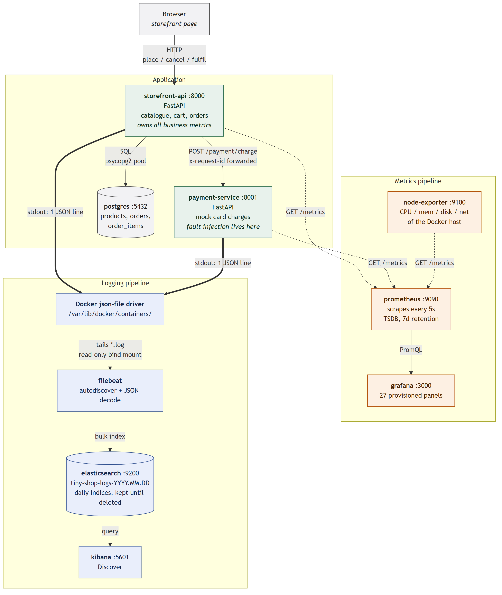

# Part D — System design

## D.1 Architecture diagram



Solid arrows are requests and data flow; dotted arrows are Prometheus scrapes
(Prometheus *pulls* — the arrow shows where the data goes); thick arrows are log
lines. The diagram source is `docs/images/architecture.mmd` (Mermaid).

### What each component does, and how they talk

| Component | Job | Talks to | How |
| :-- | :-- | :-- | :-- |
| **storefront-api** | The shop. Serves the page and the API; owns the order lifecycle. | Postgres, payment-service | SQL over a connection pool; HTTP+JSON |
| **payment-service** | Mock card processor. Approves, declines, or fails. Holds the fault injection switches. | — | Receives HTTP+JSON |
| **postgres** | System of record for products, orders and order items. | — | Receives SQL |
| **node-exporter** | Reads the host kernel's `/proc` and `/sys` and exposes them as metrics. | — | Scraped |
| **prometheus** | Pulls `/metrics` from all three targets every 5s, stores the samples. | storefront, payment, node-exporter | HTTP scrape (**pull**) |
| **grafana** | Queries Prometheus and draws the dashboard. | prometheus | PromQL over HTTP |
| **Docker log driver** | Captures each container's stdout to a file on the host. | — | Filesystem |
| **filebeat** | Tails those files, decodes our JSON, ships the documents. | Docker socket, elasticsearch | File read + HTTP bulk |
| **elasticsearch** | Stores and indexes log documents. | — | Receives bulk writes |
| **kibana** | The log search UI. | elasticsearch | HTTP query |


### Where data is stored, and why

| Data | Where | Why there |
| :-- | :-- | :-- |
| Products, orders, order items | Postgres, named volume `postgres-data` | It is transactional business state. Checkout needs `FOR UPDATE` row locks and an atomic rollback if payment fails — that is a database's job, not a cache's. |
| Metric samples | Prometheus TSDB, volume `prometheus-data`, 7-day retention | Metrics are small, numeric and regular. A time-series database compresses them enormously and answers range queries fast. They are aggregates, so losing them is a monitoring gap, not data loss. |
| Log documents | Elasticsearch, volume `elasticsearch-data`, one index per day, kept until deleted by hand (no ILM) | Logs are high-cardinality text. You search them by arbitrary field — `request_id`, `order.id` — which is an inverted index's job, and exactly what a TSDB cannot do. |
| Filebeat read offsets | Volume `filebeat-data` | So a Filebeat restart resumes where it stopped instead of re-shipping every line it has already sent. |
| Grafana state | **Nowhere — deliberately ephemeral** | The datasource and the dashboard are provisioned from files in `telemetry/grafana/`, so they are rebuilt on every start and survive even `down -v`. Only per-user UI preferences are lost, and those are not worth a volume. |
| Cart contents | The browser, in JavaScript | A cart before checkout is not business state. Keeping it client-side means the API has no session storage at all. |
| Fault-injection flags | Process memory | Deliberate. Restarting a container is guaranteed to be a complete recovery. |

### What happens when a component stops

| If this dies | What happens | Do you still see it? |
| :-- | :-- | :-- |
| **payment-service** | Checkouts fail. The storefront catches the connection error, counts `payment_calls_total{outcome="error"}`, rejects the order with 502, and **rolls the transaction back** so stock is not silently consumed. Browsing still works. | Yes — `up{job="payment-service"}` = 0, error panels spike, and every failure is logged. |
| **payment-service is slow, not down** (Part E.1) | Worse than it being down. Checkout holds its product row locks for the whole payment call, so every checkout for the same products queues behind a slow one. With the original code the queue exhausted the 10-connection pool (`PoolError` → 500) and caused deadlocks. After the fix (sorted lock order, a 2 s pool wait, 503 when it runs out) there are no crashes, but checkouts still queue — p95 ≈ 3.8 s. | Yes — payment p95 rises first, then checkout p95, in-flight requests and 5xx. The logs name the cause: `message:"unhandled exception"` grouped by `error.type`. |
| **postgres** | Checkout and order listing return 503 via `/ready`. The catalogue cannot be served. This is the one true hard dependency. | Yes — 5xx rate jumps, `db_query_duration_seconds` stops, `request completed` logs carry status 500, and an `unhandled exception` log names the driver error in `error.type`. |
| **prometheus** | **Metric collection stops. The app is unaffected.** Grafana shows gaps. Samples for the outage window are lost permanently — a pull model has no backfill. | Only in Grafana (no data) — the app itself gives no sign. |
| **grafana** | Nothing breaks. Prometheus keeps collecting; you have lost the *view*, not the data. Querying <http://localhost:9090/graph> still works. | Obviously — the page does not load. |
| **node-exporter** | Host resource panels go blank. Nothing else is affected. | `up{job="node-exporter"}` = 0. |
| **elasticsearch** | Filebeat retries with backoff and **keeps its place**. Logs queue on disk in the container log files. When Elasticsearch returns, Filebeat catches up. Short outages lose nothing. | Kibana is unavailable; metrics are completely unaffected. |
| **filebeat** | New logs stop reaching Elasticsearch, but they are still written to the container log files. On restart Filebeat resumes from its stored offset, so the gap is backfilled. | Kibana shows a gap that then fills in. |
| **kibana** | Log search is unavailable. Nothing else is affected; Elasticsearch keeps indexing. | The page does not load. |


### Things I do not fully understand yet

- **Filebeat's `filestream` offset bookkeeping.** I know the registry in
  `filebeat-data` stores a per-file read offset and that this is what makes a
  restart resume rather than replay. I do not know how it handles a file that is
  rotated and truncated by Docker *while* Filebeat is stopped, nor whether a log
  line can be lost in that window.
- **Where 38 log lines went in Part E.1.** During the faulted stage of the
  first run, 38 checkout `request completed` lines never reached
  Elasticsearch. Filebeat logged no error and the lines were not stored as
  unparsed text. It happened in the same minute as a flood of over 10,000
  plain-text traceback lines and did not happen in the re-run without them.
- **Elasticsearch shard sizing.** The single-node default is used throughout. I
  have not reasoned about how this would need to change with real log volume.

---

## D.2 Following one metric and one log end to end

### The metric: `shop_orders_placed_total`

**1 — The code updates it.**
`services/storefront-api/app/routes.py`, in `checkout()`, after the payment is
approved and the database transaction has committed:

```python
ORDERS_PLACED.labels(payment_method=payload.payment_method).inc()
```

It is declared in `services/storefront-api/app/telemetry.py`:

```python
ORDERS_PLACED = Counter(
    "shop_orders_placed_total",
    "Orders successfully placed and paid for.",
    ["payment_method"],  # bounded: card | wallet | cod
)
```

`inc()` adds 1 to an integer held in the process's Prometheus registry. Nothing
is transmitted at this moment — the value just sits in memory.

**2 — Prometheus collects it.**
Every 5 seconds Prometheus issues `GET http://storefront-api:8000/metrics`,
which returns plain text (captured 2026-09-24):

```
shop_orders_placed_total{payment_method="wallet"} 391.0
shop_orders_placed_total{payment_method="card"} 1482.0
shop_orders_placed_total{payment_method="cod"} 180.0
```

Prometheus stores each line as one sample — `(series, timestamp, value)` —
attaching the labels from `prometheus.yml`, so the stored series is really:

```
shop_orders_placed_total{payment_method="card", job="storefront-api",
                         instance="storefront-api:8000", service="storefront-api",
                         tier="application"}  1482  @1790235941.81
```

Things not stored include order id, customer. Those are unbounded
labels and are in the logs instead.

**3 — Grafana queries and displays it.**
The "Orders placed vs cancelled" panel runs:

```promql
sum(rate(shop_orders_placed_total[1m])) * 60
```

- `rate(...[1m])` — per-second increase, averaged over a trailing 1-minute
  window. `rate` exists because the raw number is cumulative and only ever
  climbs; the interesting question is "how fast", not "how many since boot".
  It also transparently handles a counter reset when the container restarts.
- `sum(...)` — collapses the three `payment_method` series into one total.
- `* 60` — converts orders/second into orders/minute, which is the unit a shop
  owner actually thinks in.

So the chart never shows the raw total (1482); it shows how fast it grew. In
the E.1 baseline stage this exact query returned **582.7 orders/min** — 10
checkouts a second, about 97% of them approved.
Grafana asks Prometheus for this once per 5-second dashboard refresh, over the
selected time range, and draws the resulting series.

### The log: `"order placed"`

**1 — The code writes it.**
Same function, immediately after the metrics are recorded
(`services/storefront-api/app/routes.py`):

```python
log_event(
    "order placed",
    event={"action": "checkout", "outcome": "placed"},
    order={"id": order_id,
           "value_dollars": round(value_dollars, 2),
           "item_count": item_count},
    payment={"method": payload.payment_method, **pay_detail},
    request_id=request_id,
)
```

`log_event()` in `structured_logging.py` adds the timestamp, service name and
level, then prints exactly one line of JSON to stdout:

```json
{"@timestamp":"2026-09-24T07:45:00.626909+00:00","service":{"name":"storefront-api","node":{"name":"e8356c4da86b"}},"log":{"level":"info"},"message":"order placed","event":{"action":"checkout","outcome":"placed"},"order":{"id":8871,"value_dollars":68.0,"item_count":2},"payment":{"method":"card","status_code":200,"duration_ms":20.3},"request_id":"62a1aef01829"}
```

**2 — Docker saves it.**
The json-file log driver wraps that line in its own envelope and appends it to
`/var/lib/docker/containers/<id>/<id>-json.log`:

```json
{"log":"{\"@timestamp\":\"2026-09-24T07:45:00.626909+00:00\", ... ,\"request_id\":\"62a1aef01829\"}\n","stream":"stdout","time":"2026-09-24T07:45:00.62731406Z"}
```

Our JSON is now a *string* inside Docker's `log` field.

**3 — Filebeat collects and parses it.**
Filebeat's docker autodiscover notices the container carries
`co.elastic.logs/enabled=true` and starts tailing that file. Then, in order:

- the `container` parser strips Docker's envelope, leaving our JSON as the
  `message` field;
- `add_docker_metadata` looks up the container id over the Docker socket and
  attaches `container.name`, `container.image.name`;
- **`decode_json_fields`** parses `message` and promotes every key to the top
  level, so `request_id` becomes a real field rather than text inside a string.
  `overwrite_keys: true` makes *our* `@timestamp` win over Filebeat's read time;
- the `timestamp` processor parses that ISO-8601 string into a real date, so
  Kibana sorts by **when the order happened**, not when the line was read;
- `drop_fields` removes Filebeat bookkeeping we never search on.

**4 — Elasticsearch stores it.**
Filebeat bulk-writes to that day's index, `tiny-shop-logs-2026.09.24`
(document `LF5g0qAB5-CQHWuFO4k8`). The stored document:

| Field | Value |
| :-- | :-- |
| `@timestamp` | `2026-09-24T07:45:00.626Z` *(date)* |
| `message` | `order placed` |
| `service.name` | `storefront-api` |
| `service.node.name` | `e8356c4da86b` |
| `log.level` | `info` |
| `event.action` | `checkout` |
| `event.outcome` | `placed` |
| `order.id` | `8871` |
| `order.value_dollars` | `68` |
| `order.item_count` | `2` |
| `payment.method` | `card` |
| `payment.duration_ms` | `20.3` |
| `request_id` | `62a1aef01829` |
| `container.name` | `storefront-api` |

Every one of those is individually searchable and aggregatable. Before
`decode_json_fields`, all of it was one opaque string.

**5 — Kibana finds it.**
In Discover, with the *Tiny Shop Logs* data view:

```
message:"order placed" and order.value_dollars > 100
```

or, to follow one customer's checkout across **both** services — the reason the
request id is propagated on the `x-request-id` header:

```
request_id:"62a1aef01829"
```

That returns four documents: the storefront's `order placed` and `request
completed` lines, and payment-service's `charge approved` and `request completed`
lines — the full path of one order through the system.
